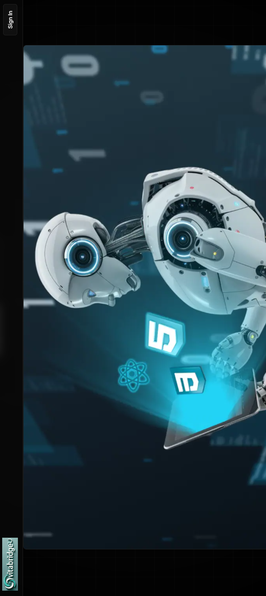

<h1 align="center">🚀 VitaBridge | AI-Powered Career Companion</h1>
<h3 align="center">Streamlining job-seeking with AI-generated resumes, cover letters, industry insights, and interview prep using Gemini AI, Next.js, Prisma, Tailwind CSS, and Shadcn UI.</h3>

<p align="center">
  
  
  
  
  
</p>

---

<h3>📘 Overview</h3>

**VitaBridge** is an AI-driven career platform designed to elevate the job-seeking experience. It automates and enhances key career development tasks, offering:

- 📄 **AI-powered Resume Builder**
- ✉️ **Custom Cover Letter Generator**
- 🧠 **Smart Interview Preparation**
- 📊 **Real-time Industry Insights**

With the integration of **Gemini AI**, the platform delivers tailored content and intelligent career support, improving job-seeker productivity by over **60%**.

---

<h3>🎯 Key Features</h3>

- ✅ **Gemini AI** for personalized and context-aware content generation.
- ✅ Tailored **resumes** and **cover letters** in seconds.
- ✅ Real-time **industry insights** to align with market trends.
- ✅ Mock **interview prep** with question generation and answer evaluation.
- ✅ Elegant, responsive design built with **Tailwind CSS** and **Shadcn UI**.
- ✅ Backend powered by **Prisma** and **Next.js API routes**.

---

<h3>🧑‍💻 Tech Stack</h3>

| Tech         | Role                                 |
|--------------|--------------------------------------|
| **Next.js**  | Full-stack React framework           |
| **Tailwind CSS** | Utility-first styling framework     |
| **Shadcn UI** | Component library for modern UIs     |
| **Gemini AI** | Generative AI for content and NLP    |
| **Prisma**    | Type-safe ORM for PostgreSQL (via Neon) |
| **Inngest**   | Background jobs & event-driven logic |

---

<h3>📸 UI Preview</h3>

<p align="center">
  
</p>

---

<h3>⚙️ Setup Instructions</h3>

```bash
# 1. Clone the repository
git clone https://github.com/your-username/vitabridge.git
cd vitabridge

# 2. Install dependencies
npm install

# 3. Configure environment variables
cp .env.example .env
# Add your Gemini API keys, database URL, etc.

# 4. Run the app
npm run dev
